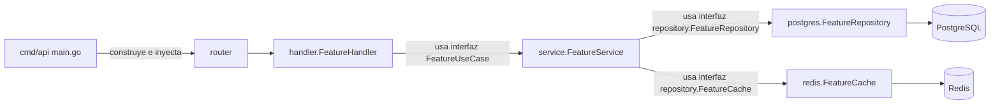
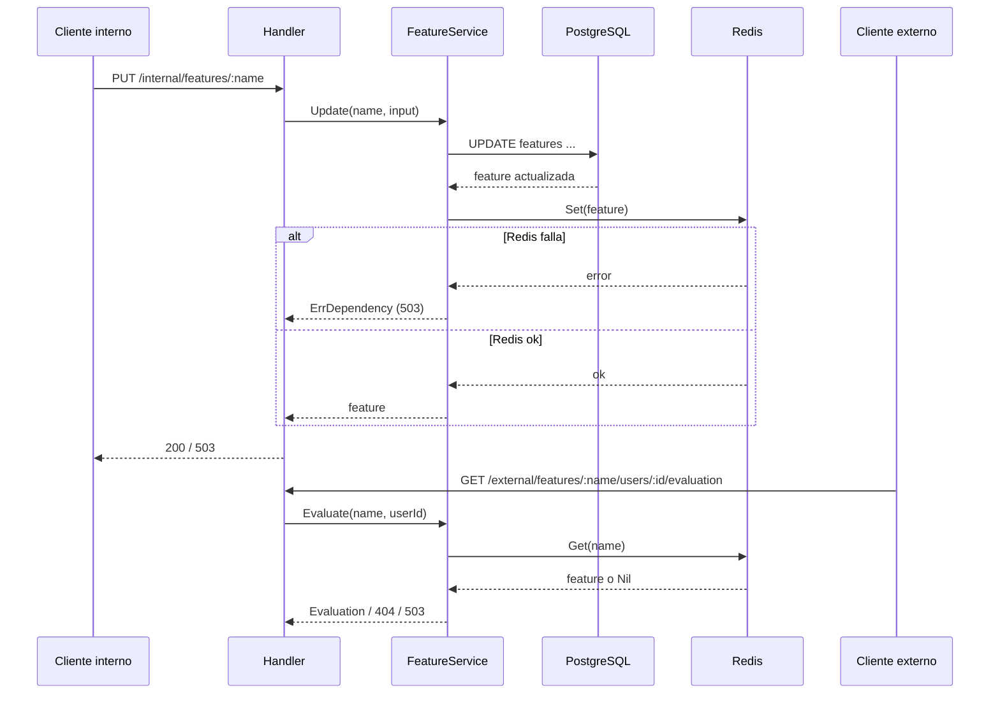

# Análisis de arquitectura y buenas prácticas

Informe técnico sobre `feature-flag-manager`: un backend en Go (API interna de administración + API externa de evaluación) y un backoffice en React/TypeScript, con PostgreSQL como fuente de verdad y Redis como espejo de lectura.

## 1. Estructura del repositorio

```
santex-challenge/
├── cmd/api/main.go              # Entry point: wiring/composition root
├── internal/
│   ├── config/                  # Carga de configuración desde variables de entorno
│   ├── domain/                  # Entidades y value objects puros (Feature, Status, Evaluation)
│   ├── repository/              # Interfaces (puertos) FeatureRepository y FeatureCache + errores de dominio
│   │   └── postgres/             # Implementación concreta contra PostgreSQL (pgx)
│   ├── cache/redis/             # Implementación concreta del espejo de lectura en Redis
│   ├── service/                 # Lógica de negocio/orquestación (casos de uso), validaciones
│   └── http/
│       ├── handler/             # Controladores Gin: parseo HTTP <-> dominio, mapeo de errores
│       └── router/              # Definición de rutas (internal/external) y middlewares
├── db/migrations/                # Migraciones SQL (golang-migrate) para la tabla features
├── docs/openapi.yaml              # Contrato OpenAPI (fuente de verdad de la API pública)
├── e2e/                          # Suite E2E en Python/pytest contra la API real
├── frontend/                     # Backoffice React + TypeScript + Vite
│   └── src/
│       ├── api.ts               # Cliente HTTP tipado + manejo de errores (ApiError)
│       ├── App.tsx              # Vistas: inventario, editor, panel de evaluación
│       └── status.ts            # Helpers de presentación (labels, formato de fecha)
├── docker-compose.yml            # PostgreSQL + Redis para desarrollo local
├── Makefile                       # Automatiza deps, migraciones, test, e2e, vulncheck
├── notes.md                      # Supuestos y decisiones de diseño
└── README.md                      # Guía de setup y contrato de consistencia
```

Cada paquete Go es pequeño y de responsabilidad única, en línea con las convenciones de `internal/` de Go para evitar que código externo dependa de detalles de implementación.

## 2. Patrones de diseño aplicados

### 2.1 Arquitectura en capas (Layered / Clean-ish Architecture)
Flujo estricto `router → handler → service → repository/cache`, donde cada capa solo conoce la interfaz inmediatamente inferior:



### 2.2 Dependency Injection manual (composition root)
`cmd/api/main.go` construye `pgxpool`, cliente Redis, repositorio, cache y servicio, e inyecta todo hacia abajo. Ningún handler crea su propio servicio ni el servicio crea sus propios clientes — cumple exactamente la regla de "construir en el borde, inyectar hacia abajo".

### 2.3 Repository Pattern / Ports & Adapters (Hexagonal)
`internal/repository/feature.go` define las interfaces `FeatureRepository` y `FeatureCache` (puertos). `postgres.FeatureRepository` y `redis.FeatureCache` son adaptadores intercambiables. El `service` sólo depende de las interfaces, nunca de pgx o go-redis directamente — permite mockear en tests unitarios (`mocks/service_mocks.go`, generados con `mockgen`).

### 2.4 Cache-Aside con escritura sincrónica (Write-Through)
En `Create`/`Update`/`Delete`, el servicio escribe primero en PostgreSQL y sincroniza inmediatamente Redis; si Redis falla, retorna `ErrDependency` (503) pero la escritura en PostgreSQL ya quedó persistida, reconciliable vía `RefreshCache`. La evaluación externa (`Evaluate`) lee *exclusivamente* de Redis, nunca cae a PostgreSQL — implementa un patrón de "cache-only reads" para separar el camino caliente de lectura del de escritura.



### 2.5 Sentinel errors + `errors.Is`/`errors.As` para mapeo de errores
`service.ErrValidation`, `service.ErrDependency`, `repository.ErrNotFound`, `repository.ErrConflict` se definen como errores centinela y se envuelven con `%w`. El handler los traduce a códigos HTTP en un único punto (`handleError`), evitando `if/else` de strings y desacoplando la capa HTTP del origen exacto del error.

### 2.6 Strategy/Seam para pruebas: interfaz `Clock`
`service.Clock` (con `systemClock` como implementación real) permite inyectar un reloj falso en tests, evitando `time.Now()` no determinístico — un patrón de "Humble Object"/Strategy minimalista.

### 2.7 Mock generation (no hand-written mocks)
`//go:generate mockgen` en `handler/generate.go` y `service/generate.go` genera mocks en subcarpetas `mocks/` dedicadas, cumpliendo la convención de "nunca escribir mocks a mano" y manteniendo separación de código generado vs. código de producción.

### 2.8 Frontend: Container/Presentational implícito + cliente API centralizado
`api.ts` centraliza todas las llamadas HTTP con manejo uniforme de errores (`ApiError`), mientras `App.tsx` separa componentes de datos (`Inventory`, `FeatureEditor`) de componentes de presentación puros (`StatusBadge`, `ConfirmDialog`, `Empty`).

## 3. Buenas prácticas identificadas

- **Separación clara de responsabilidades por capa**: el `service` no conoce SQL ni comandos Redis; los adaptadores no conocen reglas de negocio.
- **Validación centralizada en el dominio de servicio** (`validateWrite`, `validateName`, `validateUserID`), no duplicada en el handler ni en el repositorio.
- **Contrato público explícito**: `docs/openapi.yaml` documenta rutas, esquemas y códigos de estado; el README remite a él como fuente de verdad.
- **Configuración por entorno**: `internal/config` centraliza lectura de variables, sin URLs/credenciales embebidas en código; falla rápido (`Load` retorna error) si faltan variables requeridas.
- **Manejo explícito de shutdown**: `main.go` usa `signal.NotifyContext` + `server.Shutdown` con timeout, evitando cortes abruptos de conexiones en curso.
- **Errores de PostgreSQL traducidos a errores de dominio**: `scanFeature` detecta `pgx.ErrNoRows` y el código `23505` (unique violation) y los traduce a `ErrNotFound`/`ErrConflict`, evitando fugas de detalles de infraestructura hacia capas superiores.
- **Idempotencia y atomicidad en el refresco de caché**: `Replace` usa `TxPipeline` de Redis para vaciar y repoblar en una única transacción, minimizando ventanas de inconsistencia.
- **Cobertura de pruebas por capa**: tests unitarios con mocks para `service` y `handler` (múltiples archivos separados: `_test.go`, `_errors_test.go`, `_read_test.go`, `_additional_test.go`, indicando cuidado en cubrir casos de error, lectura y edge cases por separado), pruebas de repositorio contra bases reales (Testcontainers, según README), y suite E2E en Python contra la API real.
- **Automatización operativa vía `Makefile`**: targets autoexplicados (`make help`), separación de comandos de infraestructura (`deps-*`), migraciones, tests con cobertura y `govulncheck` para vulnerabilidades reales.
- **Documentación de decisiones**: `notes.md` deja explícitos los supuestos (sin auth, Redis como espejo, etc.), útil para revisores y futuros mantenedores.
- **Frontend tipado y con manejo de errores de red diferenciado** (offline, 503, 409) para dar mensajes útiles al usuario.

## 4. Oportunidades de mejora

1. **Consistencia eventual write-then-cache no es transaccional real**: si el proceso cae entre el `UPDATE` en PostgreSQL y el `Set` en Redis, la única forma de reconciliar es el refresh manual. Podría evaluarse un patrón *outbox* o un job de reconciliación periódico automático además del manual, para reducir la ventana de inconsistencia sin intervención humana.
2. **Falta de contexto/timeout explícito por operación**: los métodos de `repository`/`cache` reciben `context.Context` desde el handler (heredado del request), pero no hay timeouts explícitos por operación (p. ej. `context.WithTimeout` para llamadas a Redis/PostgreSQL), lo que podría dejar requests colgados si una dependencia se degrada lentamente.
3. **`Replace` en Redis usa `KEYS feature:*`**: el comando `KEYS` es bloqueante y no recomendado en producción para datasets grandes; se podría sustituir por `SCAN` para evitar bloquear el servidor Redis durante el refresh.
4. **No hay paginación en `List`/`GET /features`**: si el catálogo de features crece, tanto la respuesta HTTP como el `SELECT * FROM features` no tienen límites, lo que podría degradar el rendimiento del backoffice.
5. **Ausencia de rate limiting / tamaño máximo de body** a nivel de router; Gin no está configurado con `MaxMultipartMemory` ni límites de payload, aunque hay validaciones de longitud a nivel de servicio.
6. **`errorResponse` no está estandarizado en OpenAPI con un formato de error extensible** (p. ej. `code`, `details[]`); actualmente solo expone `error: string`, lo que limita la capacidad del frontend/BFF de discriminar programáticamente entre distintos tipos de error 400.
7. **No hay logging estructurado ni trazabilidad** (correlation/request ID) más allá del logger por defecto de Gin; para un servicio con dependencias externas (PostgreSQL/Redis) sería valioso loguear en JSON con niveles y IDs de request para depurar incidentes de producción.
8. **Falta separación de despliegue entre API interna y externa** (ya reconocido en el propio README como TODO): hoy ambas viven en el mismo binario/puerto, lo que impide escalarlas o asegurarlas de forma independiente.
9. **El cliente frontend (`api.ts`) no reintenta ni cachea localmente** ante fallos transitorios de red, y `App.tsx` concentra bastante lógica de UI en un solo archivo grande con líneas muy densas (poca separación en subcomponentes/archivos), lo que dificulta su mantenibilidad a medida que crezca.
10. **Ausencia de índices adicionales en la migración**: la tabla `features` solo tiene PK por `name`; si se agregan filtros futuros (por `status`, por fecha), convendría anticipar índices o al menos documentarlo como deuda técnica.

## 5. Conclusión

El repositorio sigue una arquitectura en capas limpia, con inyección de dependencias explícita, separación estricta entre puertos (interfaces) y adaptadores (PostgreSQL/Redis), y un patrón claro de cache-aside con lectura externa cache-only. Las prácticas de testing (mocks generados, Testcontainers, E2E) y la documentación de contrato (OpenAPI) están bien alineadas con estándares profesionales. Las mejoras sugeridas son principalmente de robustez operativa (timeouts, `SCAN` vs `KEYS`, observabilidad) y de escalabilidad futura (paginación, separación de despliegue), no defectos estructurales.
