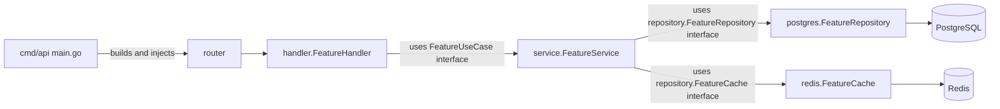
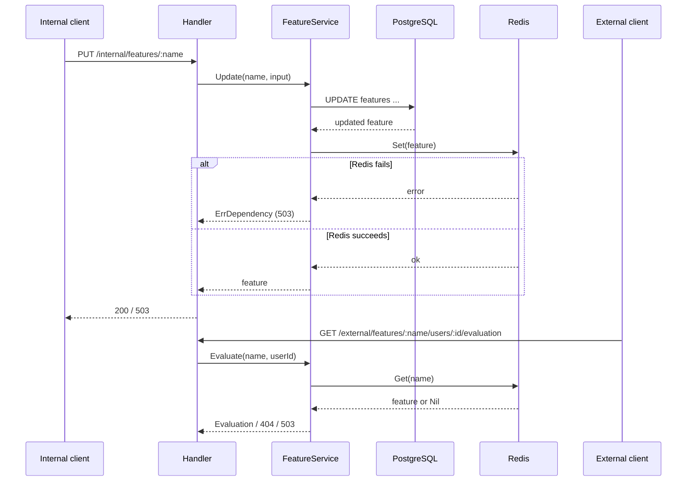

# Architecture Analysis and Best Practices

Technical report on `feature-flag-manager`: a Go backend (internal administration API + external evaluation API) and a React/TypeScript backoffice, with PostgreSQL as the source of truth and Redis as the read mirror.

## 1. Repository Structure

```
santex-challenge/
├── cmd/api/main.go              # Entry point: wiring/composition root
├── internal/
│   ├── config/                  # Loads configuration from environment variables
│   ├── domain/                  # Pure entities and value objects (Feature, Status, Evaluation)
│   ├── repository/              # FeatureRepository and FeatureCache interfaces (ports) + domain errors
│   │   └── postgres/            # Concrete PostgreSQL implementation (pgx)
│   ├── cache/redis/             # Concrete Redis read-mirror implementation
│   ├── service/                 # Business logic/orchestration (use cases), validation
│   └── http/
│       ├── handler/             # Gin controllers: HTTP parsing <-> domain, error mapping
│       └── router/              # Route definitions (internal/external) and middleware
├── db/migrations/               # SQL migrations (golang-migrate) for the features table
├── docs/openapi.yaml            # OpenAPI contract (source of truth for the public API)
├── e2e/                         # Python/pytest E2E suite against the real API
├── frontend/                    # React + TypeScript + Vite backoffice
│   └── src/
│       ├── api.ts               # Typed HTTP client + error handling (ApiError)
│       ├── App.tsx              # Views: inventory, editor, evaluation panel
│       └── status.ts            # Presentation helpers (labels, date formatting)
├── docker-compose.yml           # PostgreSQL + Redis for local development
├── Makefile                     # Automates dependencies, migrations, tests, E2E, vulncheck
├── notes.md                     # Assumptions and design decisions
└── README.md                    # Setup guide and consistency contract
```

Each Go package is small and has a single responsibility, in line with Go's `internal/` conventions to prevent external code from depending on implementation details.

## 2. Applied Design Patterns

### 2.1 Layered / Clean-ish Architecture

Strict flow: `router → handler → service → repository/cache`, where each layer knows only the immediately lower interface:



### 2.2 Manual Dependency Injection (Composition Root)

`cmd/api/main.go` builds the `pgxpool`, Redis client, repository, cache, and service, then injects everything downward. No handler creates its own service, and the service does not create its own clients—this exactly follows the rule to “build at the boundary, inject downward.”

### 2.3 Repository Pattern / Ports & Adapters (Hexagonal)

`internal/repository/feature.go` defines the `FeatureRepository` and `FeatureCache` interfaces (ports). `postgres.FeatureRepository` and `redis.FeatureCache` are interchangeable adapters. The `service` depends only on interfaces, never directly on pgx or go-redis—enabling unit-test mocking (`mocks/service_mocks.go`, generated with `mockgen`).

### 2.4 Cache-Aside with Synchronous Writes (Write-Through)

In `Create`/`Update`/`Delete`, the service writes to PostgreSQL first and immediately synchronizes Redis. If Redis fails, it returns `ErrDependency` (503), but the PostgreSQL write has already been persisted and can be reconciled through `RefreshCache`. External evaluation (`Evaluate`) reads *exclusively* from Redis and never falls back to PostgreSQL—implementing a “cache-only reads” pattern that separates the hot read path from the write path.



### 2.5 Sentinel Errors + `errors.Is`/`errors.As` for Error Mapping

`service.ErrValidation`, `service.ErrDependency`, `repository.ErrNotFound`, and `repository.ErrConflict` are defined as sentinel errors and wrapped with `%w`. The handler translates them into HTTP status codes in a single location (`handleError`), avoiding string-based `if/else` logic and decoupling the HTTP layer from the error’s exact origin.

### 2.6 Strategy/Seam for Testing: `Clock` Interface

`service.Clock` (with `systemClock` as the real implementation) makes it possible to inject a fake clock in tests, avoiding nondeterministic `time.Now()` calls—a minimal “Humble Object”/Strategy pattern.

### 2.7 Mock Generation (No Hand-Written Mocks)

`//go:generate mockgen` in `handler/generate.go` and `service/generate.go` generates mocks in dedicated `mocks/` subdirectories, following the “never hand-write mocks” convention and keeping generated code separate from production code.

### 2.8 Frontend: Implicit Container/Presentational Pattern + Centralized API Client

`api.ts` centralizes every HTTP call with uniform error handling (`ApiError`), while `App.tsx` separates data-oriented components (`Inventory`, `FeatureEditor`) from pure presentation components (`StatusBadge`, `ConfirmDialog`, `Empty`).

## 3. Identified Best Practices

- **Clear separation of responsibilities by layer**: the `service` does not know SQL or Redis commands; adapters do not know business rules.
- **Centralized validation in the service domain** (`validateWrite`, `validateName`, `validateUserID`), without duplication in handlers or repositories.
- **Explicit public contract**: `docs/openapi.yaml` documents routes, schemas, and status codes; the README refers to it as the source of truth.
- **Environment-based configuration**: `internal/config` centralizes variable loading, with no URLs or credentials embedded in code; it fails fast (`Load` returns an error) when required variables are absent.
- **Explicit shutdown handling**: `main.go` uses `signal.NotifyContext` + `server.Shutdown` with a timeout, avoiding abrupt termination of in-flight connections.
- **PostgreSQL errors translated into domain errors**: `scanFeature` detects `pgx.ErrNoRows` and code `23505` (unique violation), translating them into `ErrNotFound`/`ErrConflict` and preventing infrastructure details from leaking to upper layers.
- **Idempotence and atomicity during cache refresh**: `Replace` uses a Redis `TxPipeline` to clear and repopulate in one transaction, minimizing inconsistency windows.
- **Test coverage by layer**: unit tests with mocks for `service` and `handler` (multiple separate files: `_test.go`, `_errors_test.go`, `_read_test.go`, `_additional_test.go`, demonstrating care in covering errors, reads, and edge cases separately); repository tests against real databases (Testcontainers, according to the README); and a Python E2E suite against the real API.
- **Operational automation through the `Makefile`**: self-explanatory targets (`make help`), separation of infrastructure commands (`deps-*`), migrations, tests with coverage, and `govulncheck` for reachable vulnerabilities.
- **Documented decisions**: `notes.md` makes assumptions explicit (no auth, Redis as a mirror, and so on), which is useful for reviewers and future maintainers.
- **Typed frontend with differentiated network-error handling** (offline, 503, 409) to provide useful user messages.

## 4. Improvement Opportunities

1. **Eventual consistency in write-then-cache is not truly transactional**: if the process stops between the PostgreSQL `UPDATE` and Redis `Set`, the only reconciliation mechanism is manual refresh. An *outbox* pattern or an automatic periodic reconciliation job could be considered in addition to the manual mechanism, reducing the inconsistency window without human intervention.
2. **No explicit per-operation context/timeout**: `repository`/`cache` methods receive the `context.Context` from the handler (inherited from the request), but there are no explicit per-operation timeouts (for example, `context.WithTimeout` for Redis/PostgreSQL calls). Requests could remain stalled when a dependency degrades slowly.
3. **Redis `Replace` uses `KEYS feature:*`**: the `KEYS` command is blocking and not recommended in production for large datasets; it could be replaced with `SCAN` to avoid blocking the Redis server during refresh.
4. **No pagination in `List`/`GET /features`**: as the feature catalog grows, both the HTTP response and `SELECT * FROM features` have no limits, which could degrade backoffice performance.
5. **No rate limiting or maximum body size** at the router level; Gin is not configured with `MaxMultipartMemory` or payload limits, although length validation exists at the service level.
6. **`errorResponse` is not standardized in OpenAPI with an extensible error format** (for example, `code`, `details[]`); it currently exposes only `error: string`, limiting the frontend/BFF’s ability to programmatically distinguish among different types of 400 errors.
7. **No structured logging or traceability** (correlation/request ID) beyond Gin’s default logger; for a service with external dependencies (PostgreSQL/Redis), JSON logging with levels and request IDs would be valuable when debugging production incidents.
8. **No deployment separation between the internal and external APIs** (already recognized as a TODO in the README): both currently run in the same binary/port, preventing independent scaling or security measures.
9. **The frontend client (`api.ts`) neither retries nor caches locally** on transient network failures, and `App.tsx` concentrates substantial UI logic in a single large file with densely packed lines (limited separation into subcomponents/files), making it harder to maintain as it grows.
10. **No additional indexes in the migration**: the `features` table has only a primary key on `name`; if future filters are added (by `status` or date), indexes should be anticipated or at least documented as technical debt.

## 5. Conclusion

The repository follows a clean layered architecture, with explicit dependency injection, strict separation between ports (interfaces) and adapters (PostgreSQL/Redis), and a clear cache-aside pattern with cache-only external reads. Testing practices (generated mocks, Testcontainers, E2E) and contract documentation (OpenAPI) are well aligned with professional standards. The suggested improvements are primarily about operational robustness (timeouts, `SCAN` versus `KEYS`, observability) and future scalability (pagination, deployment separation), rather than structural defects.
